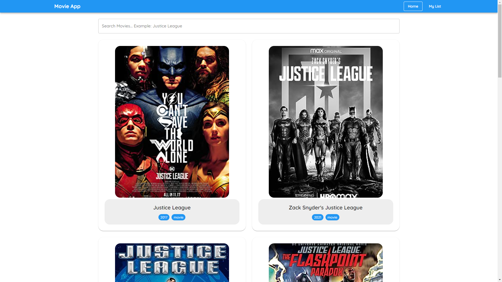

# Movie App || [[Live Demo](https://julo-movies.netlify.app/)]



This is an assignment for movie app with OMDb API for the Julo interview process.
The below information is the guideline for developers how to setup the web app locally.

---

## Tech Used

- React.js
- Typescript
- React Context API
- React Router
- axios
- Material UI
- Emotion
- React Testing Library
- Jest

---
## Introduction

This guide will walk you through the process of setting up the web app.

---

## Prerequisites

- Download and install Node 18 LTS [nodejs.org](https://nodejs.org/en)
- Ensure you have react version 18 or above

---

## Clone the Repository

```bash
git clone <repository-url>
cd <repository-name>
```

---

## Install Dependencies

```bash
npm install
```

---

## Run the React App

After setting up the environment and installing the necessary dependencies, you can run the web application:
Execute the bash command in the root directory of the project.


```bash
npm start
```

---

## Note
Check this design doc to get an overview of app.
[Design Doc for Movie App](https://docs.google.com/document/d/1xJv8IPtERKYrfYmz78BBBAUS6t0XkQOnAVWxdSVdQpU/edit?usp=sharing)